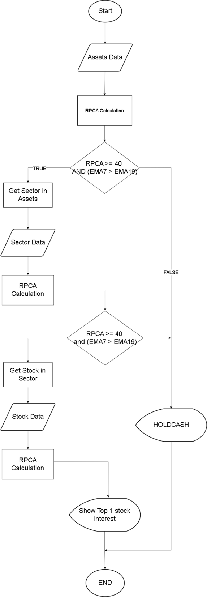
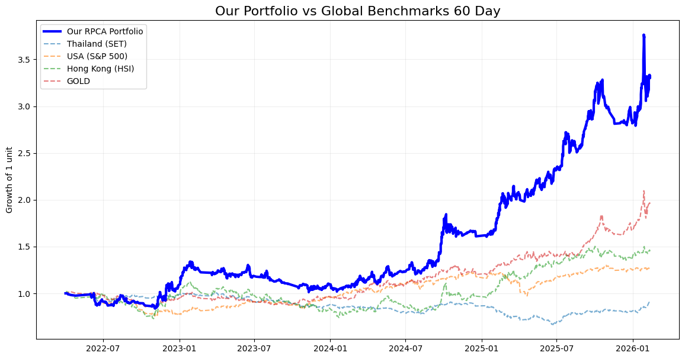
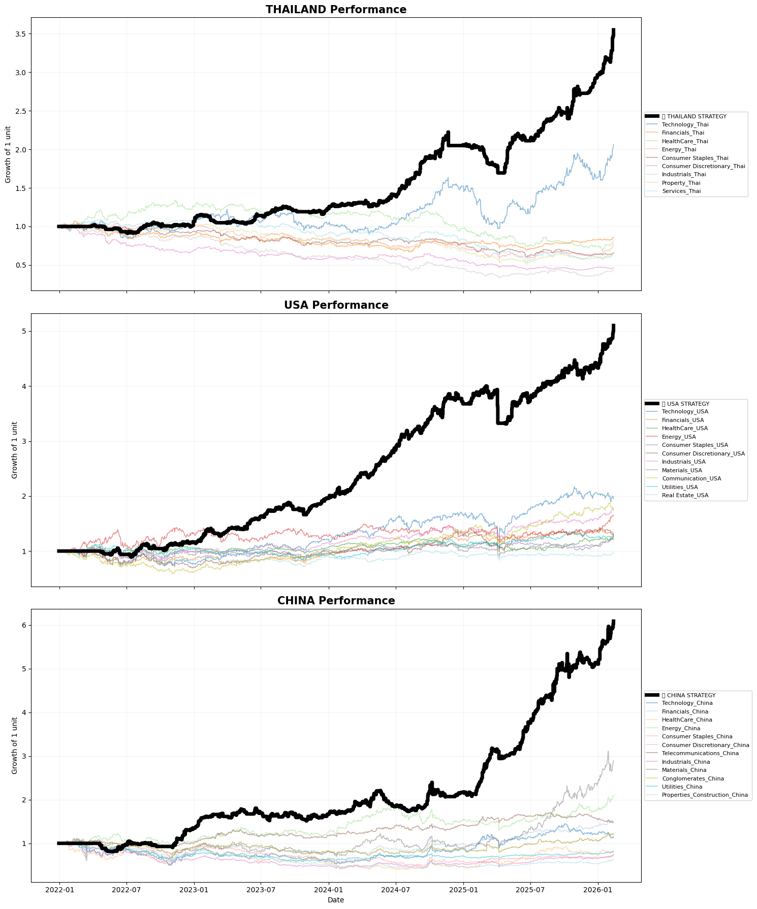

# 🌍 Global Sector Rotation System (RPCA-Based)

[](https://www.python.org/)
[](LICENSE)

ระบบเลือกหุ้นและจัดอันดับกลุ่มอุตสาหกรรมอัตโนมัติจาก 3 ตลาดหลัก (**USA, Thailand, China**) และ **ทองคำ (Gold)** โดยใช้เทคนิค **Robust Principal Component Analysis (RPCA)** เพื่อคัดกรองสัญญาณรบกวน (Noise) ออกจากแนวโน้มหลัก พร้อมกลยุทธ์การบริหารความเสี่ยงระดับมืออาชีพ

## 📊 Performance Overview


 

---

## 🚀 Key Features
* **Automated Multi-Market Scraping:** ระบบดึงข้อมูลรายชื่อหุ้นรายกลุ่มอุตสาหกรรมอัตโนมัติจาก TradingView (USA), SET (Thai) และ Investing.com (China) โดยใช้ `DrissionPage` เพื่อข้ามระบบป้องกัน Bot (Cloudflare)
* **Robust PCA (RPCA) Integration:** ใช้หลักการแยก Matrix $X = L + S$ เพื่อดึงสัญญาณแนวโน้มหลัก (Low-rank) ออกจากความผันผวนชั่วคราว (Sparse/Noise) ทำให้สัญญาณซื้อขายมีความเสถียรสูง
* **Dual-Layer Confirmation:**
    * **Layer 1:** ยืนยันเทรนด์ด้วย EMA Crossover ($EMA_{12} > EMA_{50}$)
    * **Layer 2:** คัดกรองด้วยคะแนนความแข็งแกร่ง (Absolute Strength Score)
* **Risk Management (Stay in Cash):** หากไม่มีอุตสาหกรรมใดผ่านเกณฑ์ขั้นต่ำ ระบบจะสั่งให้พอร์ตถือเงินสด 100% ทันทีเพื่อรักษาเงินต้นในช่วงตลาดหมี

## 🛠 Tech Stack
* **Language:** Python 3.10+
* **Web Scraping:** `DrissionPage` (Chromium-based)
* **Data Analysis:** `pandas`, `numpy`, `pandas_ta`
* **Financial Data:** `tvDatafeed` (TradingView Data API)
* **Environment:** `python-dotenv` (Secure Credentials)

## 📂 Project Structure
```text
├── main.py              # Script หลักสำหรับการรัน Data Pipeline ทั้งหมด
├── scraping.py          # โมดูล Scrapers สำหรับรวบรวมรายชื่อหุ้น (USA, Thai, China)
├── main2.ipynb          # Notebook สำหรับการทำ Research, RPCA Analysis และ Backtest
├── .env                 # ไฟล์เก็บรหัสผ่าน (Credentials) - *สำคัญ: ห้ามอัปโหลดขึ้น GitHub*
└── requirements.txt     # รายการ Library ที่จำเป็นต้องใช้# RPCA


